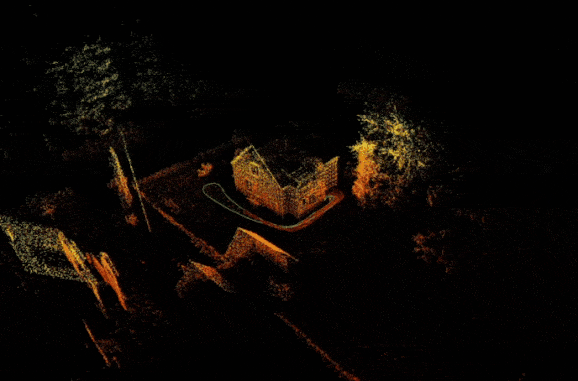
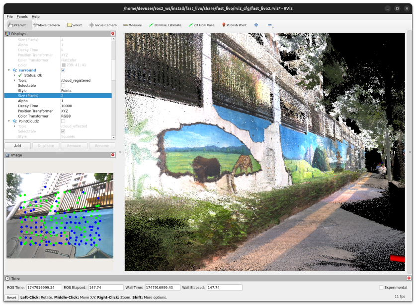

# Livox ROS2 Docker Environment

This project provides Docker images for running ROS 2 drivers for Livox lidars,
with a focus on the MID360 model.
It also includes extended images with FAST_LIO and FAST_LIVO2 for lidar
odometry and mapping. Convenience launch files and scripts are provided for
easy operation and data recording.

## Features
- **ROS 2 Humble** environment for [Livox lidar drivers](https://github.com/Livox-SDK/livox_ros_driver2)
- Tested with Livox MID360 (should be adaptable to other models)
- Optional image with [FAST_LIO](https://github.com/Ericsii/FAST_LIO) for real-time lidar odometry.
- Optional image with [FAST_LIVO2](https://github.com/integralrobotics/FAST-LIVO2) for real-time lidar-visual odometry.
- Convenience launch files for common tasks (viewing, recording, mapping)



## Building the Images

### 1. Livox ROS2 Image
```bash
docker build -t livox_ros2:humble .
```

### 2. FAST_LIO2 (optional)
This image depends on the Livox ROS2 image, which needs to be available.
```bash
docker build -f ./Dockerfile-fast_lio -t livox_ros2:humble-fast_lio .
```

### 3. FAST_LIVO2 (optional)
This image depends on the Livox ROS2 image, which needs to be available.
```bash
docker build -f ./Dockerfile-fast_livo2 -t livox_ros2:humble-fast_livo2 .
```

## Running the Containers
Before you use these docker images with a Livox sensor you must make sure that
the sensor is connected and that your network is setup correctly.
Usually that means that the host should have a static IP address of `192.168.1.5`.

### Run Livox driver
All launch files from [livox_ros_driver2](https://github.com/Livox-SDK/livox_ros_driver2/tree/master/launch_ROS2)
are available. To run the Livox container with graphics support (to show RViz) use the following command (adjust
launch file depending on the sensor you are using):
```bash
docker run --rm -it --privileged --network=host -e DISPLAY=$DISPLAY \
  -v /tmp/.X11-unix/:/tmp/.X11-unix \
  --name livox_container livox_ros2:humble \
  /bin/bash -c "./run.sh <sensor-id> ros2 launch livox_ros_driver2 rviz_MID360_launch.py"
```
_Note: the <sensor-id> should be set to the last two digits of the sensor serial number._

It is also possible to enter the container to allow for more advanced use-cases with full control of the development
environment. This is easiest done by omitting any command to `docker run`, e.g.
```bash
docker run --rm -it --privileged --network=host -e DISPLAY=$DISPLAY \
  -v /tmp/.X11-unix/:/tmp/.X11-unix \
  --name livox_container livox_ros2:humble
```

### Record raw data (PointCloud2 + IMU)
To record a ros2 bag with raw data you can use the supplied record_MID360_launch.py or record_HAP_launch.py launch
file. The rosbag will contain all /livox/* topics. For the MID360 this includes lidar points in "normal"
sensor_msgs/PointCloud2 format and IMU data in sensor_msgs/IMU format.
```bash
docker run --rm -it --privileged --network=host -e DISPLAY=$DISPLAY \
  -v /tmp/.X11-unix/:/tmp/.X11-unix -v .:/log \
  --name livox_container livox_ros2:humble \
  /bin/bash -c "cd /log && ./run.sh <sensor-id> ros2 launch record_MID360_launch.py"
```
The rosbags will be located in the same folder as the container was started from.

### Run FAST_LIO with MID360
Use the supplied launch file to run the livox driver together with FAST_LIO mapping:
```bash
docker run --rm -it --privileged --network=host -e DISPLAY=$DISPLAY \
  -v /tmp/.X11-unix/:/tmp/.X11-unix \
  --name livox_fast_lio_container livox_ros2:humble-fast_lio \
  /bin/bash -c "./run.sh <sensor-id> ros2 launch fast_lio_MID360_launch.py"
```

Set the record parameter if you want to record raw data (lidar data in CustomMsg format) while mapping.
```bash
docker run --rm -it --privileged --network=host -e DISPLAY=$DISPLAY \
  -v /tmp/.X11-unix/:/tmp/.X11-unix -v .:/log \
  --name livox_fast_lio_container livox_ros2:humble-fast_lio \
  /bin/bash -c "cd /log && /home/devuser/ros2_ws/src/run.sh <sensor-id> \
  ros2 launch /home/devuser/ros2_ws/src/fast_lio_MID360_launch.py \
  record:=true"
```
The rosbags will be located in the same folder as the container was started from.

To run FAST-LIO with a recorded bag use the follwing command:
```bash
docker run --rm -it --privileged --network=host -e DISPLAY=$DISPLAY \
  -v /tmp/.X11-unix/:/tmp/.X11-unix -v .:/log \
  --name livox_fast_lio_container livox_ros2:humble-fast_lio \
  /bin/bash -c "./run.sh ros2 launch playbag_fast_lio_MID360_launch.py bag_file:=/log/<bag-file-name>"
```

### Run FAST-LIVO2 with recorded data
Running FAST-LIVO2 is only tested with recorded data due to lack of needed hardware.

Rosbags created by the authors of FAST-LIVO2 can be found [here](https://connecthkuhk-my.sharepoint.com/:f:/g/personal/zhengcr_connect_hku_hk/ErdFNQtjMxZOorYKDTtK4ugBkogXfq1OfDm90GECouuIQA?e=KngY9Z).

The rosbags need to be converted to ROS2 format to be used. This can be done by using the `rosbags-convert` tool,
already installed on the image. To convert a ROS1 bag called `HKU_Centennial_Garden.bag` located in a `rosbags` folder
in the repo root, run:

```bash
docker run --rm -it --privileged --network=host -e DISPLAY=$DISPLAY   -v /tmp/.X11-unix/:/tmp/.X11-unix -v ./rosbags:/log  --name livox_container livox_ros2:humble-fast_livo2 /bin/bash -c "rosbags-convert --src /log/HKU_Centennial_Garden.bag --dst /log/HKU_Centennial_Garden"
```
_Note: Adjust the mount location (`./rosbags`) and the bagfile name ('HKU_Centennial_Garden') for your file._

To finilize the conversion we need to change the message type in the `metadata.yaml` file, from `livox_ros_driver/msg/CustomMsg` to `livox_ros_driver2/msg/CustomMsg` (notice the "2"):
```diff
topic_metadata:
      name: /livox/lidar
      offered_qos_profiles: ''
      serialization_format: cdr
-     type: livox_ros_driver/msg/CustomMsg
+     type: livox_ros_driver2/msg/CustomMsg
```

To run FAST-LIVO2 with the converted bag file run (adjust bagfile name if needed):
```bash
docker run --rm -it --privileged --network=host -e DISPLAY=$DISPLAY \
  -v /tmp/.X11-unix/:/tmp/.X11-unix -v ./rosbags:/log \
  --name livox_fast_livo2_container livox_ros2:humble-fast_livo2 \
  /bin/bash -c "./run.sh ros2 launch playback_fast_livo2_launch.py bag_file:=/log/HKU_Centennial_Garden"
```
_Note: The playback of the bag file is delayed by 10s to let FAST-LIO2 start up properly before any messages are sent._



## Launch Files and Scripts
- `launch/run.sh`: Sources ROS 2 workspaces, then runs the given command. If the first parameter is a number, then that
  is treated as the sensor ID and will be used to set the correct sensor IP address in the sensor config file. This
  currently only works with the MID360 sensor.
- `launch/record_MID360_launch.py`: Launch Livox driver and record all topics. This is provided for convenience and can
  be adapted for other models.
- `launch/fast_lio_MID360_launch.py`: Launches both Livox driver and FAST_LIO, with optional recording.
- `launch/playback_fast_livo2_launch.py`: Launches FAST-LIVO2 with RViz and plays back a specified ROS2 bag file.

## Notes
- These images are intended for development and testing on Linux with X11 display forwarding.
    - You might need to allow for connections to the X11 server. An easy and unsecure way to do that is by running `xhost +local:root` in a host terminal.
- Development and testing have been carried out on an Ubuntu 24.04 host machine and a Livox MID360 sensor.
- The images also contain these additional ROS2 packages:
    - [rmw_cyclonedds](https://github.com/ros2/rmw_cyclonedds/tree/humble): Alternative middleware for ROS2.
      I have had good experiences with this middleware for distributed systems.
    - [imu-tools](https://github.com/CCNYRoboticsLab/imu_tools/tree/humble): Makes it possible to visualize
      IMU message data in RViz2.

## Third-Party Licenses and Attribution

This repository provides Dockerfiles and scripts that automate the building and use of third-party software. The
following third-party projects are used:

- [Livox-SDK/Livox-SDK2](https://github.com/Livox-SDK/Livox-SDK2)
- [Livox-SDK/livox_ros_driver2](https://github.com/Livox-SDK/livox_ros_driver2)
- [Ericsii/FAST_LIO](https://github.com/Ericsii/FAST_LIO)
- [hku-mars/FAST-LIVO2](https://github.com/hku-mars/FAST-LIVO2)
- [integralrobotics/FAST-LIVO2](https://github.com/integralrobotics/FAST-LIVO2)

You are responsible for complying with the licenses of these third-party projects when building or running Docker
images that include them. This repository does not redistribute their source code, only provides build instructions
and automation.

For details, see the respective repositories and their LICENSE files.
